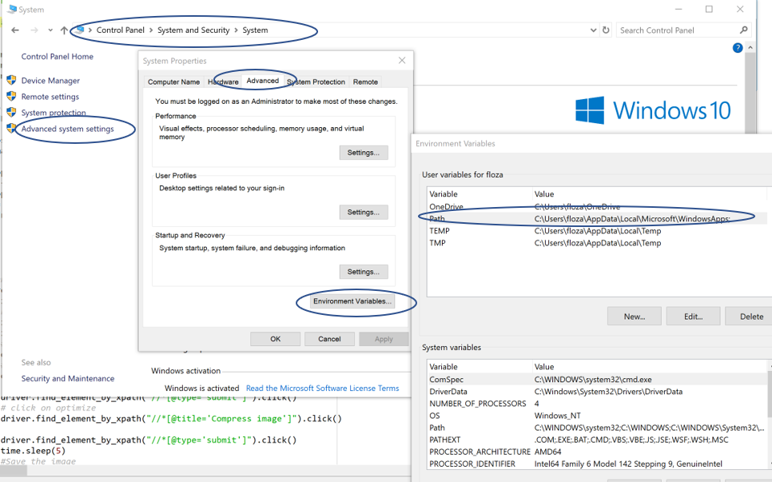

# AnimatedMaps - GIF CREATION- Readme
Stata Code that Generates Maps and Python code that animates them

Authors: Siddartha Rao and Felipe Lozano-Rojas

# 0.  Set the files to animate
-  The .jpg/.png files that are going to be animated should be in a specific folder, and they should be organized in a way that when python takes the list of them they enter in that order.
-  The stata code that is provided generates maps for specific variables using maptile in combination with its the state geography.
-  Information about Stata's Maptile can be found at: (https://michaelstepner.com/maptile/) 

# 1.	Getting started with selenium
-  Install chrome web driver from http://chromedriver.chromium.org/getting-started
-	Include the Chrome Driver location in your PATH environment variable

   - If you don’t know where the PATH is you can search for it in Windows at:
    - Control Panel\System and Security\System ->Advance system setting ->Advanced -> Environmental Variables -> Path(Set the path of the driver in this location) 

       

- Potential Bug
   -	Your chrome driver is not up to date. Error
SessionNotCreatedException: session not created: Chrome version must be between 70 and 73
(Driver info: chromedriver=2.45.615291 (ec3682e3c9061c10f26ea9e5cdcf3c53f3f74387),platform=Windows NT 10.0.17134 x86_64)
   - Go to chrome to download a compatible driver. As per May 8, 2019 Chrome Driver 2.46 solved the issue. 
   - http://chromedriver.chromium.org/downloads

# 2.	The file ezgif.py is the python file which contains the automation code. The file can be found inside the script folder
  	To run the code the following changes, have to be made
   -	Change the path of the folder in line: 110
      os.chdir("C:/Users/sidar/Box/CDC Maps/Visuals/cocaine_br")  :arrow_right: set the folder location inside the quotes 
   -	Set the value of variable gifName to the name you want the gif to be created with line.113

# 3.	Code Explanation
   -	The function downlaodLocation() changes the location of the downloaded file to the folder instead of the default location
   -  The function resize() contains the selenium steps involved in optimizing each image (reducing the size)
   -	If this line (119) is commented then, only the gif creation takes place
   -	The function gif() contains the selenium steps involved in creating the gif and  optimizing it
   -  If this line (120) is commented then, only the png/jpg optimization takes place

-Potential Bug
   -  The file names for the gif() function are required in the root folder (as opposed to the newly created folder gif. If by any case you lose them, you can copy the optimized ones again outside of the gif folder. You can erase them once the final gif is created.

# 4.	Optional Parameters (can change these values in the below lines)
The values on the right of the arrows are the values that I have set
-	Delay time (line 75) :arrow_right: 40
-	Loop (line77) :arrow_right: 2
-	Fader delay (line 81) :arrow_right: 2 
-	Fader frame (line 84) :arrow_right: 10
-	Lossy compression level (line 92) :arrow_right: 200
